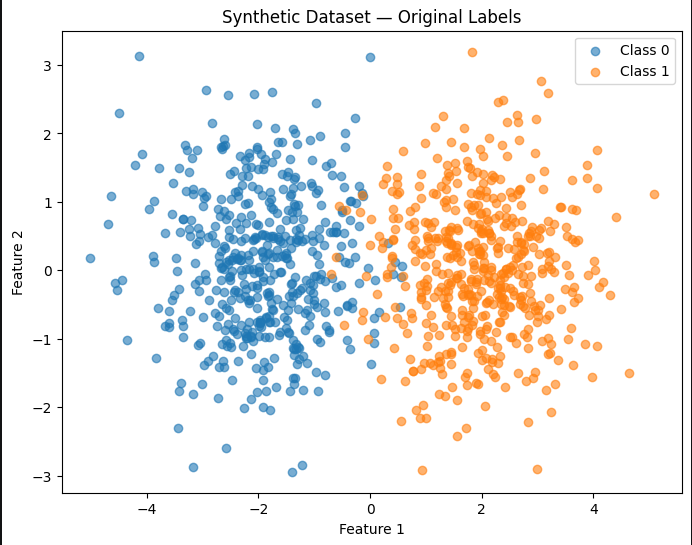
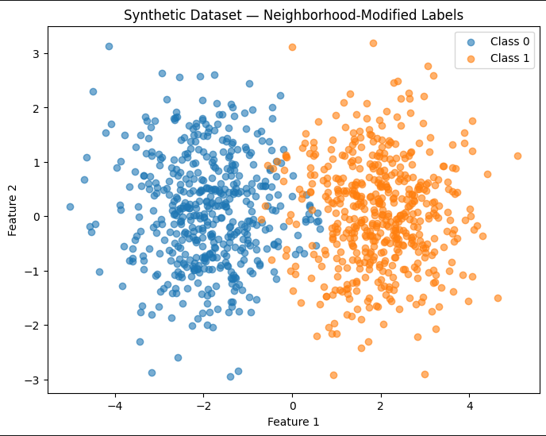

# Deep Learning with Python

This project investigates permutation-invariant neural models for classification problems, in which labels are not intrinsic 
to each data point, but instead emerge from local interactions in the feature or graph space. 

A detailed exploration of Deep Sets, Set Transformers, Janossy Pooling, and PointNet++ will be provided on a synthetic dataset 
with neighborhood-dependent label modification and on the Citeseer node classification benchmark.

Traditional classification assumes that each data point possesses a label that depends solely on its own features. 
However, in many real-world scenarios—such as social networks, citation graphs, and biological systems—labels 
may arise from interactions with surrounding data points.

The project also explores models capable of capturing such dependencies by using architectures that are invariant
to the order of set or neighborhood elements.

## Experiments

The project contains experiments with:

- Deep Sets
- Set Transformer
- Janossy Pooling
- PointNet++

models.

In the project, two experimental settings are used.

- a synthetic neighborhood-dependent classification task
- Citeseer node classification using citation neighborhoods

For the Citeseer experiments, each node is represented by:

- its own feature vector
- the feature vectors of its citation neighbors
- its class label

Neighbor labels are not used the same way model inputs are used.

## Packages

The packages below are listed based on the notebook order:

- numpy
- matplotlib
- scikit-learn
- torch
- pathlib
- pickle

## Synthetic Experiments
### Dataset Generation

The synthetic dataset contains:

- 1000 observations
- 2 features
- 2 classes
- 10 nearest neighbors

The two classes are generated from Gaussian distributions centered around:

- Class 0: [-2, 0]
- Class 1: [ 2, 0]

The labels are then modified according to the labels of each observation's neighborhood.
The neighborhood label mean is calculated using the 10 nearest neighbors.

A label is flipped when:

- |neighbor_label_mean - 0.5| < 0.1

This resulted in:

- Flipped labels: 22
- Percentage: 2.2%

The resulting task introduces a neighborhood-dependent component into the labels.

The figures below show the visualization of the synthetic dataset's original labels,

as well as the neighborhood-modified labels.

### Results

| Model  | Test Accuracy | Errors | Permutation Test |
|----------|----------|----------|----------|
| Deep Sets | 97.0% | 6 / 200 | Exact |
| Set Transformer | 96.0% | 8 / 200 | Exact |	
| Janossy Pooling | 96.5% | 7 / 200	| Approximate |
| PointNet++ | 96.0% | 8 / 200 | Exact |

## Deep Sets

The Deep Sets model uses:

- phi: 2 → 32 → 32
- rho: 34 → 32 → 1
- ReLU activations
- BCEWithLogitsLoss
- Adam optimizer with learning rate 0.001

Its test accuracy has been set to 97.0%, while permutation testing produced a maximum probability difference of 0.0.

## Set Transformer

The synthetic Set Transformer implementation uses self-attention followed by permutation-invariant pooling.
Training for 50 epochs produced a test accuracy of 96.0%, while the permutation test produced a maximum difference of 0.0.

## Janossy Pooling

Janossy Pooling was implemented using an order-sensitive base function and sampled permutations.

The synthetic experiment used 10 sampled permutations, while its test accuracy percentage produced 96.5%.
The resulting model demonstrated approximate rather than exact invariance.

Its maximum observed difference was set to 0.0001306534.

## PointNet++

A simplified PointNet++-style architecture was used for the synthetic experiment.

The implementation adapts hierarchical feature aggregation to the synthetic neighborhood setting, 
rather than reproducing the complete original 3D point-cloud PointNet++ architecture.

Test accuracy produced a percentage of 96.0%, while permutation testing produced a maximum difference of 0.0 .

## Citeseer Experiments
### Dataset

The Citeseer dataset consists of scientific publications represented by binary word features and citation relationships.

The original files are:

- citeseer.content
- citeseer.cites

The .content file contains:

- node ID
- 3,703 binary word features
- class label

The .cites file contains directed citation relationships.

For the experiments, citation relationships were converted into undirected neighborhoods.
For every valid citation (source, target), both nodes were added to each other's neighborhood.

### Dataset Statistics

After preprocessing, the dataset nodes were changed to 3312.
Its features per node were set to 3703, consisting of 6 classes and 4715 valid citation edges.

The six classes are:

| Class | Label	| Number of nodes |
|----------|----------|----------|
| AI | 0 | 249 |
| Agents | 1 | 596 |
| DB | 2 | 701 |
| HCI | 3 | 508 |
| IR | 4 | 668 |
| ML | 5 | 590 |

The dataset was divided using a stratified 80/20 train-test split.
It consists of 2649 training nodes and 663 test nodes.

The split uses:

- node indices
- a test size of 0.2
- random_state = 42
- stratify = y

### Handling Missing Citation IDs

Some node IDs appearing in `citeseer.cites` were not present in `citeseer.content`.
The preprocessing therefore removed citation edges involving missing nodes.

Original citation edges were changed to 4732, valid citation edges were changed to 4715 and removed edges to 17.

Node IDs were kept as strings because Citeseer contains both numeric-looking and textual identifiers.

## Data Loading

The Citeseer implementation uses a custom PyTorch Dataset and collate_fn.
Each sample contains:

- Center node features
- Neighbor feature matrix
- Class label

The number of neighbors differs between nodes.
For this reason, neighbor features are kept as a list of tensors rather than padded into a fixed-size tensor.
This allows the models to process variable-sized neighborhoods directly.

The prepared data is stored in:

- citeseer_prepared.npz
- citeseer_neighbors.pkl

Dataset Link: https://www.dropbox.com/scl/fi/3ww4irf42d6xgelkmih47/citeseer_prepared.npz?rlkey=t0cmx28324iorumjwhhop8j2a&st=lm8nyy9b&dl=0

## Citeseer Models
### Deep Sets

The Citeseer Deep Sets model independently transforms the neighbor features and aggregates them using summation.
The center node is embedded separately.
The two representations are then concatenated and passed to a classifier.

Test accuracy produced a percentage of 75.41%, Macro F1 produced a value of 0.73 while the maximum permutation difference is 0.0.

### Set Transformer

The Citeseer Set Transformer projects the neighbor features into a lower-dimensional representation and applies multi-head self-attention.
The resulting representations are mean-pooled before being combined with the center-node embedding.

Test accuracy produced a percentage of 75.57%, Macro F1 produced a value of 0.72 and the maximum permutation difference is 0.0.

### Janossy Pooling

The Citeseer Janossy model uses a GRU as an order-sensitive base function.
Multiple random permutations of the neighborhood are processed, and their representations are averaged.

The Citeseer experiment used:

- 5 sampled permutations
- 20 training epochs

Test accuracy produced a percentage of 76.32% and Macro F1 produced a value of 0.74.

Unlike the explicitly symmetric architectures, the finite sampled Janossy implementation produced approximate
rather than exact permutation invariance.

Using a test node with five neighbors, two probability differences were further examined.

- Maximum probability difference: 0.00335079
- Mean probability difference:    0.00138432

### PointNet++-style Model

The Citeseer PointNet++ implementation adapts the hierarchical aggregation idea of PointNet++ to graph neighborhoods.

The model uses:

- Input feature projection
- Local MLP
- Max pooling
- Second MLP
- Center-node embedding
- Classification layer

The model does not implement the complete original PointNet++ 3D point-cloud pipeline, 
such as farthest-point sampling or ball-query grouping.
Instead, it is a simplified PointNet++-style architecture designed for the Citeseer neighborhood representation.

Test accuracy produced a percentage of 75.26%.
Macro F1 produced a value of 0.72.
Weighted F1 produced a value of 0.75 and the permutation maximum difference is 0.0.

Citeseer Results
| Model | Test Accuracy | Macro F1 | Weighted F1 | Permutation Max Difference |
|----------|----------|----------|----------|----------|
| Deep Sets | 75.41% | 0.73 | 0.75 | 0.00000 |
| Set Transformer | 75.57% | 0.72 | 0.75 | 0.00000 |
| Janossy Pooling | 76.32% | 0.74 | 0.76 | 0.00335 |
| PointNet++-style | 75.26% | 0.72 | 0.75 | 0.00000 |

The results show that all four architectures achieved similar test performance on the Citeseer task, 
while their treatment of permutation invariance differs according to their aggregation mechanism.

## Permutation-Invariance Evaluation

Permutation invariance was evaluated by keeping the center node fixed and changing only the ordering of its neighbor features.
For each model, the output probabilities before and after permutation were compared.

The maximum absolute difference between the probability vectors was used as the primary measure:
- max(|p_original - p_permuted|)

For Deep Sets, Set Transformer, and the PointNet++-style model, the tested permutations produced a maximum difference of 0.0.

The Janossy implementation produced small non-zero differences because it uses a finite number of sampled permutations together 
with an order-sensitive GRU.

# Reproducibility

The experiments use fixed random seeds where specified, including:

- random_state=42

for the Citeseer train-test split.

Model training uses the Adam optimizer with a learning rate of 0.001.
The exact results correspond to the notebook executions documented during the project development.